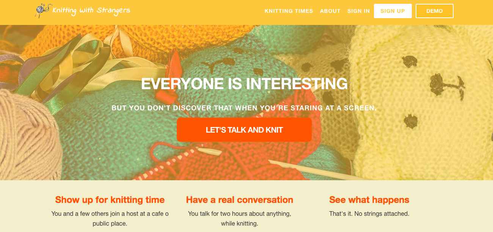
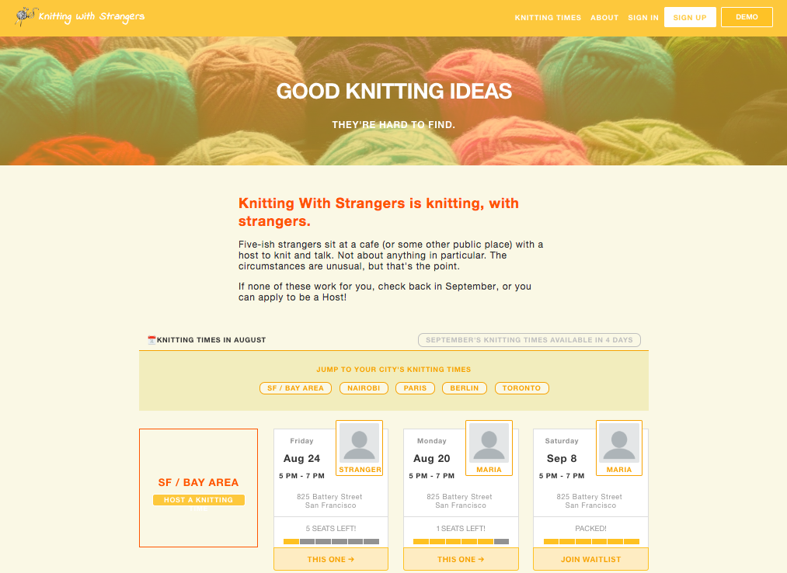
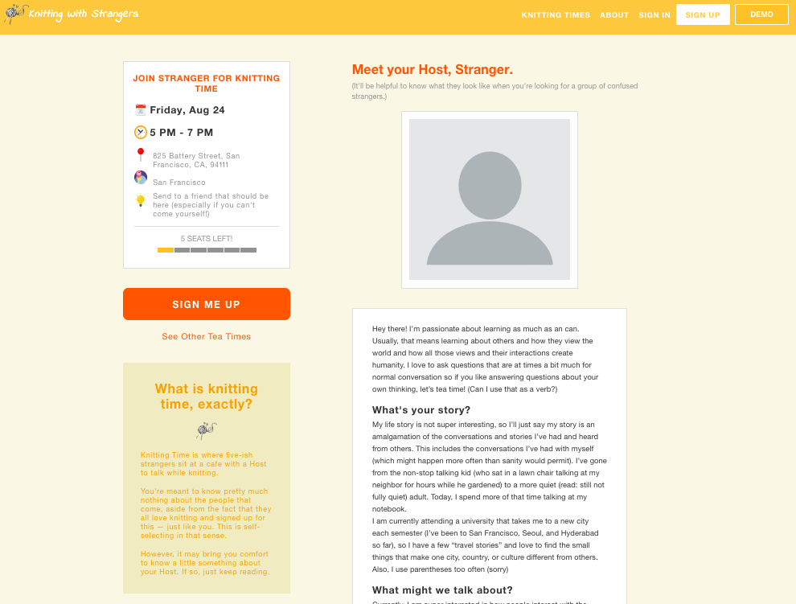
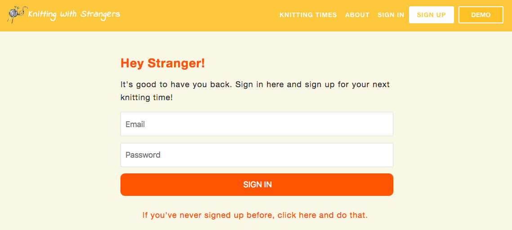
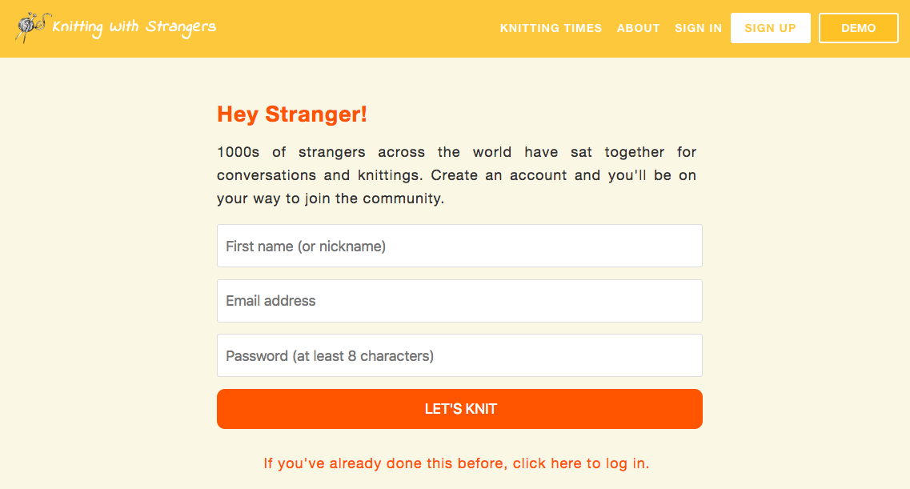
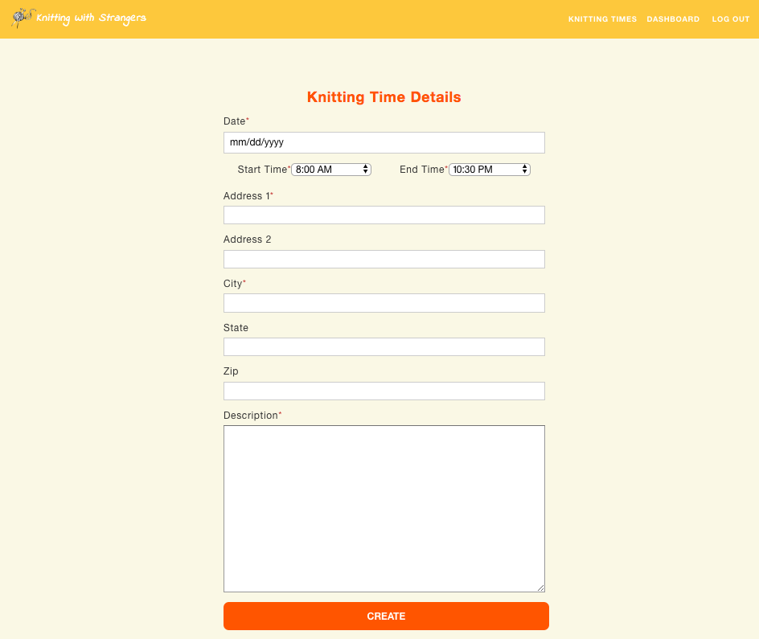
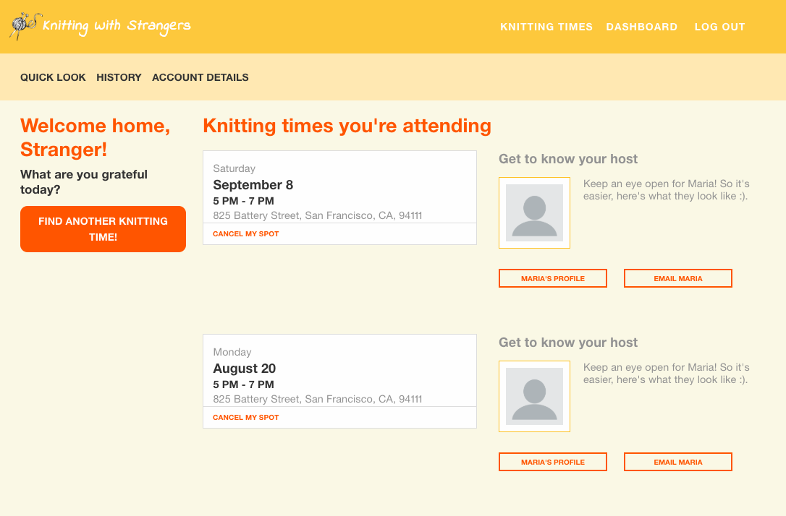

# README

## [Live Demo](https://knittingwithstrangers.herokuapp.com/)

Knitting with Strangers is a web app that promotes and organizes meet ups for strangers who enjoy knitting. It allows users to create events, and book a spot as guests.

This project is a [Tea With Strangers](http://www.teawithstrangers.com/) clone, and its first version was created in two weeks. Improvements will be added in the future.


## Technologies Used

* React.js/Redux
* Ruby on Rails (2.3.1p112)
* Heroku
* HTML5 and CSS

## Main Technical Features

* Secure frontend to backend user authentication using BCrypt.
* Everybody, logged in or not, can see all Knitting Times in detail.
* Users can host a Knitting Time. They have to be logged in, and create a new Knitting Time from an specific city.
* Users can attend a Knitting Time. They have to be logged in, and not be the host of the Knitting Time.
* Users can cancel spots where they are already registered.

### Home
Home page it is a presentational component that contain information of the web app.
From this page users can go to Knitting Time Index, Sign up and Sign in.
Also, there is DEMO option, where any user can sign in to "Stranger" session, and go through the app.

### City Index with Knitting Times
This page contain all areas and their Knitting Times.
From here, any logged in user can go to Knitting Time Create page or an specific KnittingTime Show page.

### Knitting Time Show Page
Here the user, logged in or not, can see all Knitting Time information.
The user can book an spot if he/she is logged in and is not attending or hosting the Knitting Time.
The max capability of a Knitting Time is 5 users, if there are more than 5 users, he/she will be added to the waitlist.

### Session
If the user have already an account can sign in using his/her email and password.

To create a new account the user need to register her/his name or nickname, in addition to the email and password.

### Knitting Time Create Page
It is a simple form where the future host can set Knitting Time informacion

### Profile Page
Here the user can see in details her/his future Knitting Times, which is attending and hosting.


## Tables and Associations.
Knitting with Strangers uses 4 tables: `users`, `knitting_times`, `areas`, and `knitting_times_enrollments`.
User has many enrollments, attending Knitting Times and hosting Knitting Times.
Area have many Knitting Times.

## Routes, Controllers and Views
Profile page has is own route.
Knitting Times can be created from an specific area.
```rb
  Rails.application.routes.draw do
    namespace :api, defaults: {format: :json} do

      resource :session, only: [:create, :show, :destroy]
      resources :users, only: [:create, :show, :update]

      get 'me', to: 'users#me'

      resources :areas, only: [:create, :index] do
        resources :knitting_times, only: [:create]
      end

      resources :knitting_times, only: [:show, :update, :destroy] do
        resources :knitting_time_enrollments, only: [:create]
      end

      resources :knitting_time_enrollments, only: [:show, :destroy]

    end
    root "static_pages#root"
  end
```
All informations is got when the Knitting Times page, where is the Area Index:
`app/views/api/areas/index.json.jbuilder`
```rb
  json.knitting_areas do
    @areas.each do |area|
      json.set! area.id do
        json.extract! area, :id, :name
        json.set!(:knitting_times, area.knitting_times.map { |kt| kt.id })
      end
    end
  end

  json.knitting_times do
    kts = []
    @areas.each do |area|
      kts.concat(area.knitting_times)
    end
    kts.each do |kt|
      json.set! kt.id, kt
    end
  end

  json.knitting_time_enrollments do
    ktes = []
    @areas.each do |area|
      ktes.concat(area.enrollments)
    end
    ktes.each do |kte|
      json.set! kte.id, kte
    end
  end

  json.users do
    @users.each do |u|
      json.set! u.id do
        json.extract! u, :id, :username, :email, :phone, :description
      end
    end
  end
```

Action RECEIVE_ALL_AREAS is present in almost all reducers, for example:
`frontend/reducers/knitting_times_reduser.js`
```js
  import { RECEIVE_ALL_AREAS } from '../actions/area_actions';
  import { RECEIVE_KNITTING_TIME } from '../actions/knitting_time_actions';
  import { toObject } from '../util/functions'
  import merge from 'lodash/merge';

  export default (state = {}, action) => {
    Object.freeze(state);
    switch (action.type) {
      case RECEIVE_ALL_AREAS:
        return action.areas.knitting_times;
      case RECEIVE_KNITTING_TIME:
        return merge({}, state, { [action.knitting_time.id]: action.knitting_time })
      default:
        return state;
    }
  };
```
